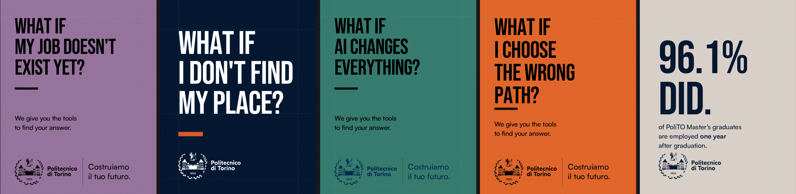
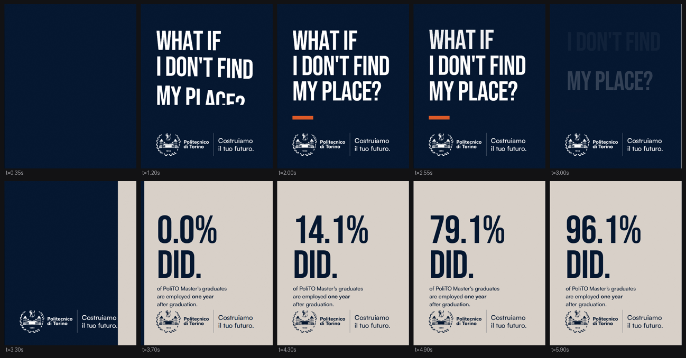
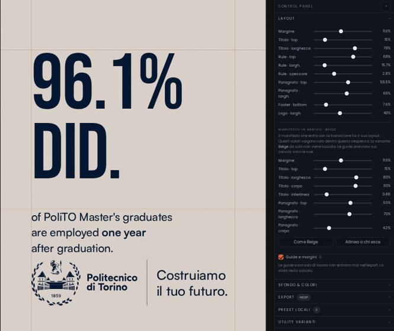

# Poli Text Lab

Studio di kinetic typography per la campagna **Politecnico di Torino — *What if…***.
Un solo file HTML: nessuna build, nessun server, nessuna dipendenza da installare.
Si apre col doppio clic e si esporta in WebP o in sequenza PNG.



---

## Avvio

```bash
open index.html          # macOS
xdg-open index.html      # Linux
start index.html         # Windows
```

GSAP e le librerie di export arrivano da CDN, quindi la prima apertura richiede
rete; i font (Bebas Neue e Satoshi) sono incorporati nel file come data URI e
funzionano anche offline. Aprire il file da `file://` va bene: l'unica cosa che
serve via HTTP sono gli sfondi WebGL di Unicorn Studio, se li si usa.

Se il repository viene pubblicato con **GitHub Pages**, `index.html` è già la
radice: lo studio sta su `https://<utente>.github.io/<repo>/` e il codex su
`/codex.html`.

## Cos'è

Un editor di animazioni tipografiche con tre parti: il canvas al centro, il
control panel a destra, la timeline in basso. Le clip si trascinano, si
duplicano, si aggiungono dalla libreria effetti al playhead. `⌘Z` / `⌘⇧Z` per
annullare e ripetere, `G` per le guide, `Space` per play.

**Sei varianti.** Cinque colorway singole — Purple, Navy, Green, Orange, Beige —
e in fondo alla lista **Blu + Beige**, che non è una sesta colorway ma una regia:
il blu pone la domanda, una maschera entra da destra e porta il beige, il dato si
conta. Logo, filetto e claim non si muovono mai: cambiano solo colore quando la
maschera li attraversa.



**24 effetti** in sei famiglie, ognuno applicabile a titolo, paragrafo e claim:

| Famiglia | Effetti |
| --- | --- |
| Split · chars | mask Y, fade + Y, flip 3D, jitter caotico, scale pop |
| Split · words | mask Y, mask + skew |
| Split · lines | mask Y, mask + skew, clip reveal, rotate 3D |
| Codrops / Scramble | scramble deterministico, scramble text (plugin GSAP) |
| Uscita | lines, words, chars, elemento — con distanza alternata |
| Counter / Transizione | counter numerico, wipe colore con semi-parallasse |

Lo split usa `SplitText` di GSAP con il suo `mask` nativo, e il livello di split
(lines / words / chars) è l'unione di quello che le clip di quel target chiedono:
un titolo con entrata in chars e uscita in lines viene splittato una volta sola.

## Il manifesto in arrivo

La transizione di colorway non è un fondale: il manifesto che entra ha due target
dedicati in timeline — **Titolo in arrivo** e **Paragrafo in arrivo** — che
accettano qualsiasi effetto e le cui clip si spostano come tutte le altre. Il
counter del dato è una clip, non un parametro nascosto.

Margine e posizioni di quel manifesto si regolano nel pannello **Layout**, nel
blocco *Manifesto in arrivo*: margine, top, larghezza, corpo e interlinea del
titolo, top, larghezza e corpo del paragrafo. I valori partono da quelli della
variante di arrivo e non toccano quella variante quando è usata da sola. Le sue
guide sul canvas sono arancioni, quelle della variante attiva ciano.



## Export

* **Frame singolo** in WebP, JPEG o PNG, scegliendo il frame, la scala (1×–4×) e la qualità.
* **Sequenza** di frame in uno ZIP, con intervallo e passo.

Il naming è `poli_<variante>_<w>x<h>_x<scala>_f<frame>.webp`.

Due dettagli non ovvi ma necessari perché il frame esportato sia identico a
quello a schermo: la maschera del wipe è un contenitore `overflow: hidden` a cui
viene animata la larghezza, e non un `clip-path` (che il renderer di export non
rasterizza); e gli effetti che riscrivono testo — counter e scramble — dipingono
dentro un `modifier` GSAP, non in `onUpdate`, perché in scrub e in export GSAP
sopprime le callback.

## Preset e sessione

Tutto resta nel browser: la sessione corrente in `localStorage`, i preset in una
lista locale (`⌘S` per salvarne uno). Niente rete, niente account.

C'è una **revisione dei default** (`DEFAULTS_REV`): quando cambia un valore di
sistema — un colore, un peso, un margine — le sessioni salvate prima non possono
più vincere sullo stile di sistema, mentre testi e timeline restano intatti. È il
meccanismo che evita il caso peggiore: un file corretto che sembra sbagliato
perché il browser sta riproponendo valori vecchi. In Tipografia ci sono anche due
bottoni per ripristinare lo stile di sistema a mano, su una variante o su tutte.

## Codex

`codex.html` è il codex del sistema visivo: principio, colorway con i rapporti di
contrasto, griglia, tipografia, uso del logo, motion, transizioni con lo
storyboard della sequenza, export e una lista di do/don't. Si apre come pagina a
sé, in tema chiaro o scuro.

## Test

Le suite guidano Chromium con Playwright e intercettano le CDN servendo copie
locali, così girano anche offline e in modo deterministico.

```bash
npm install                 # copie locali di gsap, html2canvas, jszip, font
pip install playwright && playwright install chromium
cd tests && python3 func.py     # 72 combinazioni effetto × target, undo/redo, preset, export, drag
```

| File | Cosa verifica |
| --- | --- |
| `func.py` | ogni effetto su ogni target, history, preset, export WebP e ZIP, drag delle clip |
| `wipe.py` | le quattro direzioni del wipe, wipe in catena, export a metà transizione |
| `check.py` | colori leggibili su ogni colorway, font caricati, nessuna barra dietro i testi |
| `repro.py` | una sessione vecchia non può sovrascrivere lo stile di sistema |
| `story2.py` | la sequenza Blu + Beige: layer, target in arrivo, counter, footer fermo |
| `ovr.py` | i comandi del manifesto in arrivo spostano davvero il layer, al pixel |
| `mig10.py` | l'aggiornamento di una sessione salvata conserva i tempi delle clip |
| `storyexp.py`, `expmid.py` | export della sequenza, anche a counter in corsa |
| `align.py`, `cnt.py` | allineamento fra i due livelli, counter in scrub |

Gli output finiscono in `tests/out/`, che è ignorato da git.

## Struttura

```
index.html      lo studio: markup, stile, engine, UI, IO — tutto qui
codex.html      il codex del sistema visivo
docs/img/       immagini del README
tests/          suite Playwright + paths.py e route.py condivisi
package.json    solo dipendenze di test
```

`index.html` è volutamente un file unico: è un deliverable che deve poter essere
mandato a qualcuno e aperto, non un progetto da compilare. Dentro è diviso in
blocchi commentati — stato e history, render del poster, registry degli effetti,
build della timeline, UI, export.

## Licenza e diritti

Il codice è di Metalab / Politecnico di Torino: scegliete voi la licenza prima di
rendere pubblico il repository.

Due cose da sapere prima di pubblicarlo:

* **Il marchio del Politecnico di Torino** è incorporato come SVG. È proprietà
  dell'ateneo e vale solo dentro questo progetto: in un repository pubblico va
  concordato con loro, o sostituito con un segnaposto.
* **I font sono incorporati come data URI.** Bebas Neue è SIL OFL, quindi
  ridistribuibile. **Satoshi** (Indian Type Foundry / Fontshare) è gratuito per
  uso personale e commerciale, ma la sua licenza va verificata per la
  ridistribuzione dentro un repository pubblico.

Se il repository resta privato, nessuno dei due punti è un problema.
